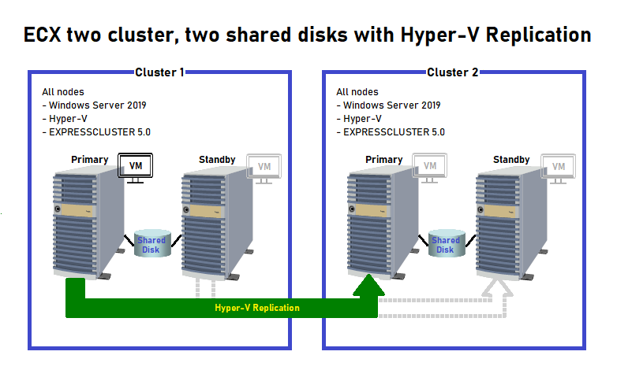

# ECX 2 cluster two shared disks with Hyper-V Replication
This document gives more details about this particular solution.

## Script Details
- Variables need to be set in **SetEnvironment.bat** in order for the scripts to function properly.
- **Start.bat** determines if any action needs to be taken. A PowerShell script is called, and if replication is determined to be progressing normally, no action is taken. If a ‘move group’ or failover just occurred, replication is changed to occur between the active servers on each cluster and the following actions are taken:
  -	Determine which cluster has the Hyper-V Primary server role and Replica server role.
  -	Remove replication from the Primary and Replica servers if still enabled.
  -	Register the VM in Hyper-V Manager if it has not been done on the server the script is run from.
  -	Enable the VM files on the Hyper-V Replica’s Replica server as the replica source.
  -	Enable VM replication from the Hyper-V Replica’s Primary server to the Replica server.
  -	Start replication.
  -	Start VM on Hyper-V Replication Primary server*    
    *This is the only step not done on the Replica server.    
- **Stop.bat** determines what kind of stop event occurred. If the script resource or group was stopped, no action is taken. If it is a ‘group move’ or failover, a PowerShell script is called and VM replication is removed from the Hyper-V Primary and Replica servers. The VM is also stopped.
    
Scripts start or stop on the active server in either cluster. If the script fails to enable replication, stopping the script resource and starting it again may fix the problem.    

Currently Cluster1 is assumed to host the Primary (source) server for replication and Cluster2 hosts the Replica server. Separate scripts exist for the Primary server and the Replica server. Once a method is created to determine which cluster hosts the Primary replication role with 100% accuracy, the Primary server and Replica server roles can be switched between clusters.    

Link to [scripts](../scripts/).
## Setup
1.	Prepare four Windows 2019 servers (Standard or Datacenter). 
2.	Join all servers to the same domain.
3.	Install Hyper-V on all servers.
4.	Create one iSCSI shared disk for both clusters and connect two servers to each disk. 
5.	Install ECX 5.0 on all four servers, being sure to Filter Settings of Shared Disk.
6.	Open necessary ports through the firewall on each server for ECX.
7.	Reboot all servers.
8.	Create two clusters of two nodes each, Cluster-1 and Cluster-2 (both nodes accessing the same disk), and add the following resources under the failover group:    
    -	fip resource    
    -	sd resource
9.	Before uploading the configuration file, go to the API tab of Cluster Properties and Enable API Service (HTTP Communication Method is fine) in order to use RESTful API calls.
10.	Install node.js 10.16.0 or 10.21.0 on all cluster nodes (for RESTful API calls).
11.	Test the clusters (move failover group between nodes in cluster) and also make sure that RESTful API commands work from nodes in Cluster-1 to nodes in Cluster-2.
    ````
    e.g. curl.exe http://<fip or ip>:29009/api/v1/groups -u <User Name>:<Password>
    ````
    Note that the output will be in json format
12.	Install a VM on the active node of Cluster-1 with all files stored on the iSCSI shared disk.
13.	Enable all servers in each cluster as Hyper-V Replica servers with Kerberos authentication.
14.	From Hyper-V Manager enable replication from the VM on the active node of Cluster-1 to the active node of Cluster-2.
15.	After replication has completed, add the failover scripts in ECX Manager.
16.	Test to verify that the configuration is correct.
## Testing
Cluster-1 and Cluster-2 active node 
- Stop group
  Expected result: VM will continue to run but replication will be interrupted.
- Start group    
  Expected result: No changes will be made and replication will continue normally.
- Move group from primary node to standby node within cluster 1    
  Expected result: Replication origination (VM replication's Primary server) will change to standby node. Replica server on cluster 2 will stay the same. VM will start on standby node.
- Move group back from standby node to primary node within cluster 1    
  Expected result: Replication origination (VM replication's Primary server) will change to primary node. Replica server on cluster 2 will stay the same. VM will start on primary node.
- Move group from primary node to standby node within cluster 2    
  Expected result: VM replication will change to standby node and standby node will become new Replica server. VM will remain in Off state.
- Move group from standby node to primary node within cluster 2    
  Expected result: VM replication will change to primary node and primary node will become new Replica server. VM will remain in Off state.
## Problematic scenarios
- The active node in both clusters fails over at the same time
Concern: Depending on the timing, the scripts to modify replication might interfere with each other, leading to failure re-enabling replication.

## Potential Enhancements
- Hyper-V replication monitoring
- Cross-cluster VM failover

## Other Notes
- Stopping the script resource and starting it again should fix replication in the event that the scripts failed or did not complete after a group move or failover.
